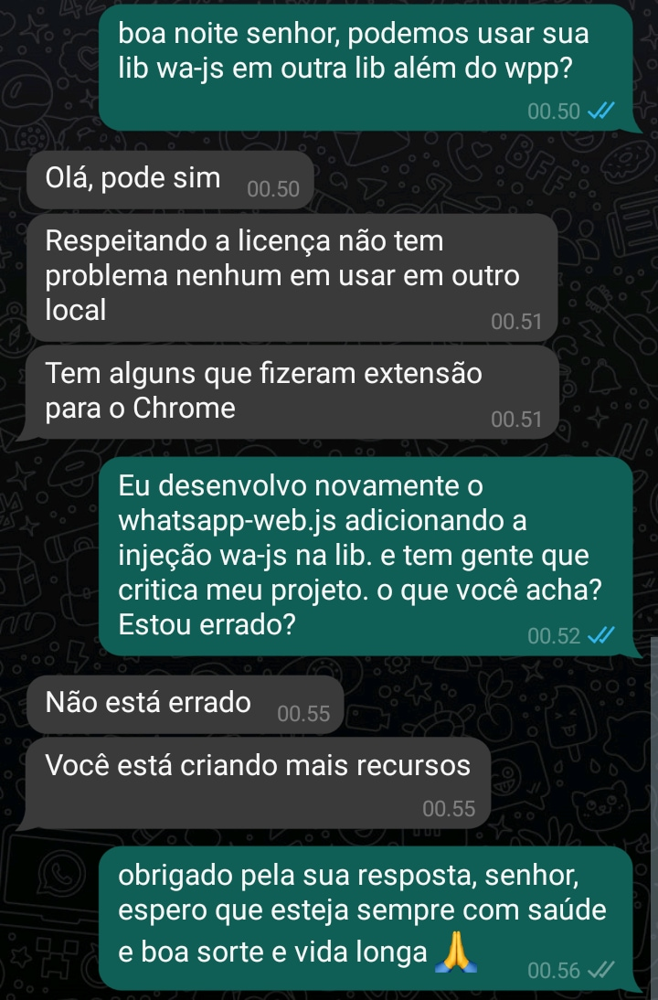

# MYWAJS
 > **Warning**: Project ini sedang dikembangkan ke esm & berpindah ke playwright

 

TQ TO @edgard

DOKUMENTASI [KLIK DISINI](https://amiruldev20.github.io/mywajs)

 > **Warning**: Library ini adalah pengembangan dari whatsapp-web.js
 
 > **Note**: INI ADALAH REPO BARU DENGAN SEMUA FUNCTION YANG DIPERBARUI
 
 ##  FUNCTION EXTRA
| Feature  | Status |
| ------------- | ------------- |
| Convert ES Module To CommonJS | ✅ |
| Convert CommonJS To ES Module | ✅ |
| Save Contact | ⏳ |
| Code Fixed Beta | ✅ |
| Change Language Code Beta | ✅ |
| Read Story  |  ✅  |
| Call Number |  ✅  |
| Call Groups |  ✅  |
| Create Avatar | ✅ |
| Accept / Reject Member | ✅ |
| Get Story | ✅ |
| Reject Call | ✅ |
| Accept Call | ⏳ |
| Upload Story Text  |  ✅  |
| Upload Story Image |  ⏳  |
| Upload Story Video |  ⏳  |
| Upload Story VN  |   ⏳  |
